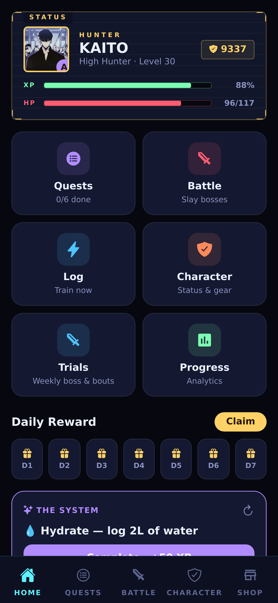
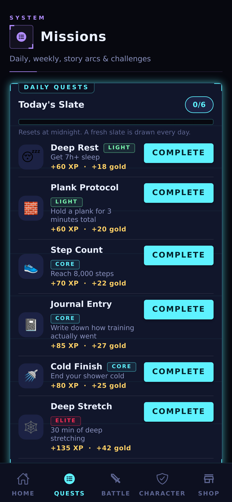
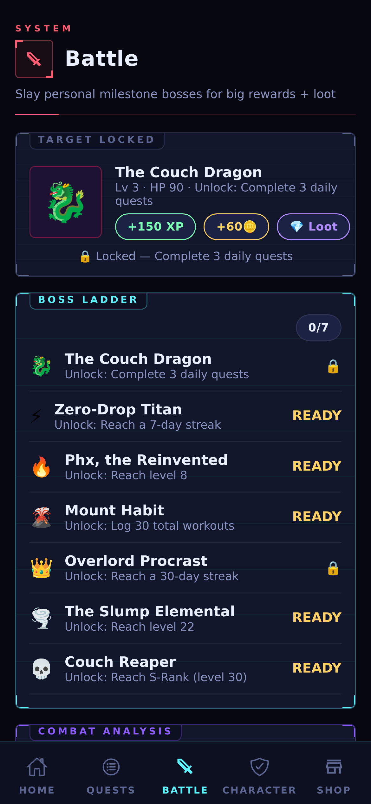
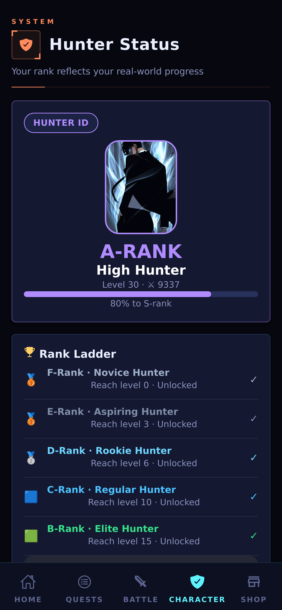

# FORGE

A fitness RPG for Android. Log a workout, earn XP, level your stats, climb the
ranks, and fight bosses.

Built with Expo / React Native. The game engine is pure TypeScript with no React
dependency, so the rules are testable in isolation.

**FORGE runs entirely on your device.** No account, no server, no network calls,
no analytics, no ads, no in-app purchases. Your save file never leaves your
phone. Every feature is unlocked for everyone.

Licensed under [AGPL-3.0](#license).

---

## Screens

<p align="center">
  
  
  
  
</p>

<p align="center"><em>Home · Missions · Battle · Hunter Status</em></p>

---

## Setup

```bash
git clone https://github.com/knightscans014-ctrl/Forge-Fitness
cd Forge-Fitness
npm install
```

There is nothing to configure — no `.env`, no API keys, no backend project to
create. Clone and run.

```bash
npm run web      # fastest dev loop, runs in a browser
npm start        # Expo Go on a physical device
```

### Checks

```bash
npm run typecheck
npm test
npm run lint
```

Use the `npm run` scripts rather than `npx tsc` / `npx eslint` directly — `npx`
will silently download an unrelated package (`tsc@2.0.4`) or a major version
the config doesn't match, instead of using the pinned local binary.

---

## How it works

Your entire game state is one JSON object persisted to `AsyncStorage` through
`src/services/storage.ts`. That is the whole persistence layer.

All game rules live in `src/engine/` as plain functions over that state object.
The engine imports nothing from React or React Native, which is why it can be
unit-tested directly — see `src/engine/__tests__/`.

Every mutation goes through `mutate()` in `src/context/GameContext.ts`, which
runs the change, re-checks achievements and daily resets, fires any
level-up/rank-up celebration, and writes to disk. Adding a feature usually means
adding a function in `src/engine/` and calling it inside `mutate()`.

### Difficulty paths

`PREMIUM_TIERS` in `src/engine/content.ts` — Ranger, Elite, Monarch — is a
leftover name from when this was a paid app. They are now free difficulty paths
that only change XP and gold rates, switchable anytime from the Shop. The
constant keeps its old name because it is threaded through the engine and
renaming it is a wide, mechanical change nobody has needed yet.

### No anti-cheat

There is deliberately none. The save file is plain JSON on your own device and
you are welcome to edit it. There is nobody to cheat against and no purchase
to defend, so integrity checks would only punish honest users on rooted phones.

### Single-player only

FORGE has no multiplayer, and no part of it pretends otherwise. The Weekly
Trial is a solo endurance boss with a large HP pool you chip away at across the
week. Training Bouts are scripted sparring partners at fixed power levels —
benchmarks for your own progress, not other people. There is no leaderboard,
no guild, and no chat.

---

## Layout

```
src/engine/      game rules, pure TypeScript, no React — unit tested
src/services/    AsyncStorage persistence
src/screens/     UI
src/context/     the Zustand game store
src/components/  shared UI primitives
src/theme/       colors and icons
tools/           dev scripts (README screenshots) — not part of the app
```

---

## Contributing

Issues and pull requests are welcome. Keep `npm run typecheck` and `npm test`
green, and prefer putting logic in `src/engine/` with a test over putting it in
a screen.

See [CONTRIBUTING.md](CONTRIBUTING.md) for the full workflow, including how the
screenshots above are regenerated.

---

## License

GNU Affero General Public License v3.0. Use it, modify it, self-host it. If you
distribute a modified version or run one as a network service, you must publish
your source under the same license.

### Artwork

The artwork in `assets/` was generated by the project author using AI image
tools and is released under
[CC BY-NC-SA 4.0](https://creativecommons.org/licenses/by-nc-sa/4.0/) — share
and adapt it non-commercially, with attribution, under the same terms.

The name "FORGE" is not covered by either license. Fork the code freely, but
ship it under your own name.
